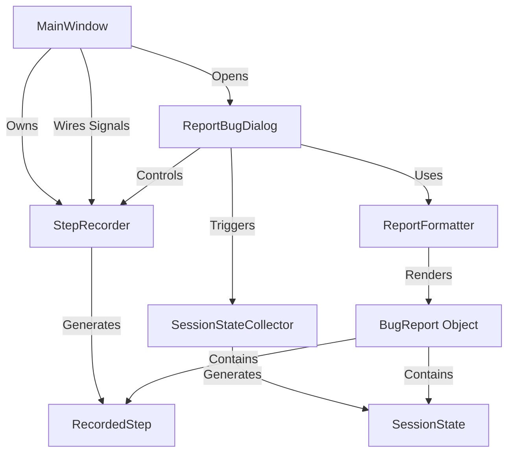

# Feature Implementation: Report Bug

This document provides a comprehensive overview of the "Report Bug" feature in PyProbe, including its architecture, data models, and complete source code. It is designed to provide an LLM with the full context needed to understand, debug, or extend the feature.

## 1. Architecture Overview

The Report Bug feature follows a **Capture-Collect-Format** pattern:

1.  **Capture (Step Recording):** A `StepRecorder` instance is owned by `MainWindow`. It is permanently wired to various domain signals (e.g., "probe added", "file opened"). When active, it serializes these events into a list of `RecordedStep` objects.
2.  **Collect (Session Snapshot):** When the user triggers a bug report, a `SessionStateCollector` gathers a snapshot of the current application state (open files, active probes, active plots).
3.  **Format (Report Generation):** A `ReportFormatter` takes the description, recorded steps, and session snapshot to produce a single plaintext report. It has specialized logic for "LLM mode" (e.g., including line numbers and context snippets).

### Component Interaction Diagram



---

## 2. Core Data Models

### `pyprobe/report/report_model.py`
Defines the immutable data structures used to pass information between the collector and the formatter.

```python
from dataclasses import dataclass


@dataclass(frozen=True)
class OpenFileEntry:
    path: str
    is_probed: bool
    is_executed: bool
    has_unsaved: bool
    contents: str | None = None


@dataclass(frozen=True)
class ProbeTraceEntry:
    name: str
    source_file: str
    shape: tuple[int, ...]
    dtype: str


@dataclass(frozen=True)
class EquationEntry:
    eq_id: str
    expression: str
    status: str
    is_plotted: bool


@dataclass(frozen=True)
class GraphWidgetEntry:
    widget_id: str
    what_plotted: str
    is_docked: bool
    is_visible: bool


@dataclass(frozen=True)
class RecordedStep:
    seq_num: int
    description: str
    timestamp: float


@dataclass(frozen=True)
class SessionState:
    open_files:    tuple[OpenFileEntry, ...]    = ()
    probed_traces: tuple[ProbeTraceEntry, ...]  = ()
    equations:     tuple[EquationEntry, ...]    = ()
    graph_widgets: tuple[GraphWidgetEntry, ...] = ()
    captured_at:   float                        = 0.0


@dataclass(frozen=True)
class BugReport:
    description:    str
    steps:          tuple[RecordedStep, ...] | None  = None
    baseline_state: SessionState | None              = None
    open_files:     tuple[OpenFileEntry, ...] | None = None
    environment:    dict | None                      = None
    logs:           str | None                       = None
```

---

## 3. Step Recording Logic

### `pyprobe/report/step_recorder.py`
The `StepRecorder` provides a generic way to log application events into human-readable steps.

```python
import time
from typing import Callable

from pyprobe.report.report_model import RecordedStep


class StepRecorder:
    """Records user-visible steps as RecordedStep objects.

    Lifecycle:
        recorder = StepRecorder()
        recorder.connect_signal(some_signal, "description")
        recorder.start()
        # ... signals fire and/or recorder.record("manual step") is called
        steps = recorder.stop()  # returns frozen tuple
    """

    def __init__(self) -> None:
        self._is_recording: bool = False
        self._steps: list[RecordedStep] = []
        self._seq_num: int = 0
        self._connections: list[tuple] = []  # (signal, slot) pairs for cleanup

    @property
    def is_recording(self) -> bool:
        return self._is_recording

    @property
    def steps(self) -> tuple[RecordedStep, ...]:
        return tuple(self._steps)

    def start(self) -> None:
        """Activate recording.  Calling start() twice is a no-op."""
        if self._is_recording:
            return
        self._is_recording = True

    def stop(self) -> tuple[RecordedStep, ...]:
        """Deactivate recording and return frozen snapshot."""
        self._is_recording = False
        return tuple(self._steps)

    def clear(self) -> None:
        """Empty the step list and reset seq_num."""
        self._steps.clear()
        self._seq_num = 0

    def record(self, description: str) -> None:
        """Append a RecordedStep if currently recording.  No-op otherwise."""
        if not self._is_recording:
            return
        self._seq_num += 1
        self._steps.append(
            RecordedStep(
                seq_num=self._seq_num,
                description=description,
                timestamp=time.time(),
            )
        )

    def connect_signal(
        self,
        signal,
        description: str | Callable[..., str],
    ) -> None:
        """Connect a Qt signal so that each emission records a step."""
        if callable(description):
            formatter = description
            def slot(*args):
                self.record(formatter(*args))
        else:
            fixed = description
            def slot(*args):
                self.record(fixed)

        signal.connect(slot)
        self._connections.append((signal, slot))
```

---

## 4. Signal Wiring (Central Hub)

### `pyprobe/gui/main_window.py` (Wiring Section)
The `MainWindow` connects almost all significant domain signals to the recorder. This provides a detailed "audit log" of what the user did before a bug occurred.

```python
    def _connect_step_recorder(self) -> None:
        """Wire all domain signals to the step recorder."""
        r = self._step_recorder

        # -- Probe lifecycle --
        r.connect_signal(
            self._probe_controller.probe_added,
            lambda anchor, panel: f"Added probe: {anchor.identity_label()}")
        r.connect_signal(
            self._probe_controller.probe_removed,
            lambda anchor: f"Removed probe: {anchor.identity_label()}")

        # -- Overlay addition / removal --
        r.connect_signal(
            self._probe_controller.overlay_requested,
            lambda target_panel, overlay_anchor:
                f"Overlaid {overlay_anchor.identity_label()} onto panel containing {_safe_anchor_label(target_panel)}")

        # -- Watch sidebar --
        r.connect_signal(
            self._code_viewer.watch_probe_requested,
            lambda anchor: f"Added watch: {anchor.identity_label()}")

        # -- Panel management --
        r.connect_signal(
            self._probe_container.panel_closing,
            lambda panel: f"Panel closed: {_safe_anchor_label(panel)}")

        # -- Script execution --
        r.connect_signal(
            self._control_bar.action_clicked_with_state,
            lambda state: f"Clicked {state}")
        r.connect_signal(self._control_bar.stop_clicked, "Clicked Stop")

        # -- Per-panel signals (forwarded via probe_controller) --
        r.connect_signal(
            self._probe_controller.panel_lens_changed,
            lambda anchor, wid, name: f"Changed format on window {wid} to {name}")
        r.connect_signal(
            self._probe_controller.panel_trace_visibility_changed,
            lambda anchor, wid, name, visible: f"Toggled visibility of {name} in window {wid} ({anchor.identity_label()})")
        r.connect_signal(
            self._probe_controller.panel_interaction_mode_changed,
            lambda anchor, wid, mode: f"Changed tool to {mode} in window {wid} ({anchor.identity_label()})")
        r.connect_signal(
            self._probe_controller.panel_view_reset_triggered,
            lambda anchor, wid: f"Reset view in window {wid} ({anchor.identity_label()})")
        r.connect_signal(
            self._probe_controller.panel_view_adjusted,
            lambda anchor, wid: f"Adjusted view in window {wid} ({anchor.identity_label()})")

        # ... (other signal connections)
```

---

## 5. UI and Control

### `pyprobe/gui/report_bug_dialog.py`
The UI orchestrates the recording state and report assembly.

```python
class ReportBugDialog(QDialog):
    def __init__(self, collector: SessionStateCollector, recorder: StepRecorder, parent: QWidget | None = None) -> None:
        super().__init__(parent)
        self._collector = collector
        self._recorder = recorder
        self._formatter = ReportFormatter(max_file_bytes=50 * 1024)
        self._setup_ui()

    def _start_recording(self) -> None:
        self._recorder.clear()
        self._baseline = self._collector.collect()
        self._recorder.start()
        self._indicator.show_indicator()

    def _stop_recording(self) -> None:
        self._recorded_steps = self._recorder.stop()
        self._indicator.hide_indicator()

    def _trigger_generate(self) -> None:
        state = self._collector.collect()
        # ... collects environment, logs, and open files ...
        
        report = BugReport(
            description=self._description_edit.toPlainText().strip(),
            steps=self._recorded_steps,
            baseline_state=self._baseline,
            open_files=state.open_files,
            environment=environment,
            logs=logs_text,
        )

        self._report_text = self._formatter.render(report, llm_mode=llm_mode)
        self._preview.setPlainText(self._report_text)
```

---

## 6. Formatting Logic

### `pyprobe/report/formatter.py`
Handles rendering the report into plaintext, with logic to extract code snippets and line numbers when LLM mode is enabled.

```python
class ReportFormatter:
    def render(self, report: BugReport, llm_mode: bool = False, include_full_file: bool = True) -> str:
        if not llm_mode:
            return self._render_default(report, include_full_file)
        return self._render_llm(report, include_full_file)

    def _render_llm(self, report: BugReport, include_full_file: bool) -> str:
        parts: list[str] = ["=== Bug Report ===", report.description]
        
        if report.steps:
            parts.append("
--- Steps ---")
            for step in report.steps:
                parts.append(f"{step.seq_num}. {step.description}")

        if report.open_files:
            parts.append("
--- Open Files ---")
            for entry in report.open_files:
                parts.append(f"  {entry.path}")
                if entry.contents:
                    # Specialized logic to extract ±5 lines around referenced probes
                    parts.append(self._render_numbered_contents(entry))
        
        return "
".join(parts)
```

---

## 7. State Collection

### `pyprobe/report/session_snapshot.py`
Provides a decoupled way to collect application state via getter callables.

```python
class SessionStateCollector:
    def __init__(self, file_getter, probe_getter, equation_getter, widget_getter) -> None:
        self._file_getter = file_getter
        self._probe_getter = probe_getter
        # ...

    def collect(self) -> SessionState:
        return SessionState(
            open_files=tuple(self._file_getter()),
            probed_traces=tuple(self._probe_getter()),
            captured_at=time.time(),
        )
```
