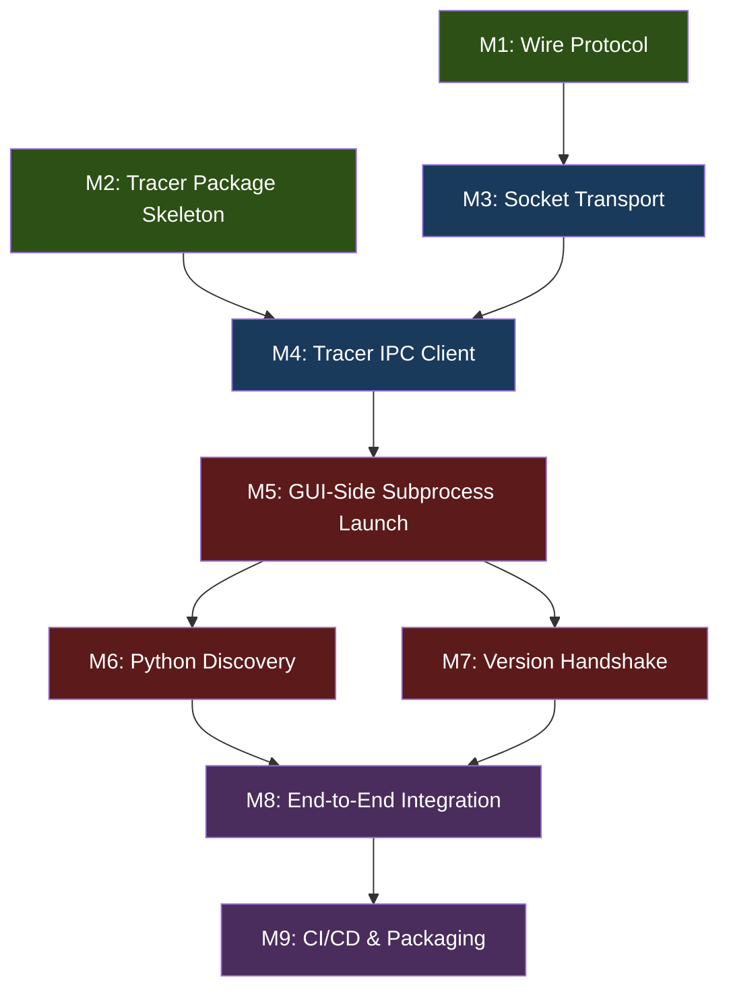

# PyProbe Rearchitecture: Multi-Milestone TDD Plan

> **Principle**: Every milestone is defined by its **tests first, code second**. You never write production code without a failing test already in place. Tests are not afterthoughts — they are the spec.

DONE M5. Next M6.

---

## Milestone Dependency Graph



**Parallelizable**: M1 and M2 can proceed concurrently (no dependency).

---

## M1 — Wire Protocol (Pure Data Layer)

**Goal**: Define a serialization format for all messages that works over raw byte streams — no `pickle`, no `multiprocessing.Queue` coupling. This is the foundation everything else builds on.

**What changes**: New module `pyprobe/ipc/wire_protocol.py`.

**Why TDD-first is easy here**: The wire protocol is a pure function — `encode(Message) → bytes` and `decode(bytes) → Message`. Zero side effects, zero I/O. Perfect for unit tests.

### Tests to write first — `tests/ipc/test_wire_protocol.py`

| # | Test | What it proves |
|---|------|----------------|
| 1 | `test_roundtrip_simple_command` | `CMD_ADD_PROBE` with an anchor dict survives encode→decode |
| 2 | `test_roundtrip_scalar_data` | `DATA_PROBE_VALUE` with a float payload roundtrips |
| 3 | `test_roundtrip_small_array` | 1D numpy array < 10KB is correctly serialized in the payload |
| 4 | `test_roundtrip_large_array` | 1M-sample complex128 array is length-prefixed as raw bytes and faithfully roundtrips (dtype, shape, values) |
| 5 | `test_roundtrip_batch_message` | `DATA_PROBE_VALUE_BATCH` with multiple probes roundtrips |
| 6 | `test_roundtrip_all_message_types` | Parametrized over every `MessageType` enum member |
| 7 | `test_decode_truncated_bytes_raises` | Truncated input raises `ProtocolError`, never silently corrupts |
| 8 | `test_decode_garbage_raises` | Random bytes raise `ProtocolError` |
| 9 | `test_large_array_performance` | 1M complex128 encode+decode < 50ms (regression gate) |
| 10 | `test_framing_multiple_messages` | Multiple messages written to the same buffer can be read back one at a time via a streaming decoder |

### Design

```
Frame format (each message):
┌──────────────────┬──────────────────┬──────────────────────────┐
│ 4 bytes: magic   │ 4 bytes: length  │ length bytes: payload    │
│ 0x50 0x50 0x52 42│ (big-endian u32) │ (header + body)          │
└──────────────────┴──────────────────┴──────────────────────────┘

Payload:
┌─────────────────────────┬──────────────────────────────────────┐
│ JSON header (variable)  │ Binary array data (optional)         │
│ { msg_type, payload,    │ raw ndarray.tobytes() blocks         │
│   timestamp, arrays: [  │ referenced by index                  │
│     {dtype, shape, off} │                                      │
│   ] }                   │                                      │
│ + NUL terminator        │                                      │
└─────────────────────────┴──────────────────────────────────────┘
```

- **JSON for structure**, raw `tobytes()` for numpy arrays → minimal serialization overhead.
- The `arrays` list in the JSON header describes each array's dtype, shape, and byte-offset into the binary section.
- `ProbeAnchor` uses its existing `to_dict()`/`from_dict()` for JSON serialization.
- `MessageType` serialized as its `.name` string for debugging readability.

### Deliverables

- [ ] `pyprobe/ipc/wire_protocol.py` — `encode_message()`, `decode_message()`, `FrameReader` (streaming)
- [ ] `tests/ipc/test_wire_protocol.py` — all 10 tests above

### Run

```bash
./.venv/bin/python -m pytest tests/ipc/test_wire_protocol.py -v
```

---

## M2 — `pyprobe-tracer` Package Skeleton

**Goal**: Create the `pyprobe_tracer/` package directory with the correct structure, entry point (`__main__.py`), and `pyproject.toml`. No IPC code yet — just the bones.

**What changes**: New top-level directory `pyprobe_tracer/` alongside `pyprobe/`.

**Why TDD-first is easy here**: The entry point is a CLI — test it with `subprocess.run` and assert exit codes + stderr messages.

### Tests to write first — `tests/tracer_pkg/test_tracer_entry.py`

| # | Test | What it proves |
|---|------|----------------|
| 1 | `test_module_is_runnable` | `python -m pyprobe_tracer --help` exits 0 and prints usage |
| 2 | `test_missing_script_arg` | Running without a script arg exits non-zero with clear error |
| 3 | `test_missing_socket_arg` | Running without `--socket` exits non-zero with clear error |
| 4 | `test_version_flag` | `python -m pyprobe_tracer --version` prints version string |
| 5 | `test_nonexistent_script` | Passing a script that doesn't exist exits 1 with "File not found" |
| 6 | `test_tracer_importable` | `import pyprobe_tracer` works and `pyprobe_tracer.__version__` is defined |

### Package structure

```
pyprobe_tracer/
├── __init__.py          # __version__ = "0.1.0"
├── __main__.py          # argparse CLI: --socket, --version, <script.py>
├── engine/              # will hold tracer, capture_manager, anchor, etc. (M4)
│   └── __init__.py
├── ipc/                 # will hold wire_protocol + socket client (M4)
│   └── __init__.py
└── pyproject.toml       # minimal: name, version, dependencies=[numpy]
```

### Deliverables

- [ ] `pyprobe_tracer/` package with skeleton files
- [ ] `pyprobe_tracer/pyproject.toml` — pip-installable package
- [ ] `tests/tracer_pkg/test_tracer_entry.py` — all 6 tests

### Run

```bash
./.venv/bin/python -m pytest tests/tracer_pkg/test_tracer_entry.py -v
```

---

## M3 — Socket Transport Layer

**Goal**: Create a bidirectional socket transport that moves `bytes` between two endpoints. This sits below the wire protocol — it just moves framed bytes over TCP or Unix sockets.

**What changes**: New module `pyprobe/ipc/socket_transport.py` (shared by both GUI and tracer).

**Why TDD-first is easy here**: Spin up a server + client in-process, send bytes, assert they arrive intact.

### Tests to write first — `tests/ipc/test_socket_transport.py`

| # | Test | What it proves |
|---|------|----------------|
| 1 | `test_server_accepts_connection` | `SocketServer.accept()` returns a connected transport |
| 2 | `test_send_recv_small` | 100 bytes sent from client arrive at server identically |
| 3 | `test_send_recv_large` | 10MB blob arrives intact (exercises chunked reads) |
| 4 | `test_bidirectional` | Server sends to client AND client sends to server |
| 5 | `test_client_disconnect_detected` | Server's `recv()` raises `ConnectionClosed` when client disconnects |
| 6 | `test_server_shutdown_detected` | Client's `recv()` raises `ConnectionClosed` when server shuts down |
| 7 | `test_concurrent_send_recv` | Two threads sending simultaneously on same connection don't corrupt |
| 8 | `test_unix_socket_transport` | Same tests pass over Unix domain socket (skip on Windows) |
| 9 | `test_connect_timeout` | Connecting to a non-listening port raises `ConnectionError` within 2s |

### Design

```python
class SocketServer:
    def __init__(self, host="127.0.0.1", port=0):  # port=0 → OS picks
    def address(self) -> tuple[str, int]: ...
    def accept(self, timeout=5.0) -> SocketTransport: ...
    def close(self): ...

class SocketClient:
    @staticmethod
    def connect(host, port, timeout=5.0) -> SocketTransport: ...

class SocketTransport:
    """Framed message transport over a connected socket."""
    def send_frame(self, data: bytes): ...        # length-prefix + send
    def recv_frame(self) -> bytes: ...             # read length-prefix + recv
    def close(self): ...
```

- `send_frame`/`recv_frame` handle the 4-byte length prefix internally.
- The wire protocol (M1) calls `transport.send_frame(encode_message(msg))`.
- Thread-safe: internal lock on send, recv is single-reader.

### Deliverables

- [ ] `pyprobe/ipc/socket_transport.py` — `SocketServer`, `SocketClient`, `SocketTransport`
- [ ] `tests/ipc/test_socket_transport.py` — all 9 tests

### Run

```bash
./.venv/bin/python -m pytest tests/ipc/test_socket_transport.py -v
```

---

## M4 — Tracer IPC Client (Connect the Tracer to Sockets)

**Goal**: Wire `pyprobe_tracer` to use the socket transport + wire protocol from M1/M3. The tracer package gets a `TracerIPCClient` that replaces the old `IPCChannel(is_gui_side=False)`.

**Depends on**: M1 (wire protocol), M2 (tracer skeleton), M3 (socket transport).

**What changes**:
- Move/copy `core/tracer.py`, `core/capture_manager.py`, `core/anchor.py`, `core/anchor_matcher.py`, `core/data_classifier.py`, `core/capture_record.py`, `core/sequence.py` into `pyprobe_tracer/engine/`.
- Create `pyprobe_tracer/ipc/client.py` — `TracerIPCClient` class.
- Rewrite `pyprobe_tracer/__main__.py` to connect to the socket, receive commands, run the script with tracing, and send data back.

### Tests to write first — `tests/tracer_pkg/test_tracer_ipc_client.py`

| # | Test | What it proves |
|---|------|----------------|
| 1 | `test_client_connects_to_server` | `TracerIPCClient.connect(host, port)` succeeds |
| 2 | `test_client_receives_add_probe_cmd` | Server sends `CMD_ADD_PROBE`, client's `recv_command()` returns it |
| 3 | `test_client_sends_probe_value` | Client sends `DATA_PROBE_VALUE`, server receives it with correct anchor + value |
| 4 | `test_client_sends_large_array` | 1M-sample array round-trips through client→server path |
| 5 | `test_client_sends_batch` | `DATA_PROBE_VALUE_BATCH` with 3 probes arrives correctly |
| 6 | `test_client_sends_script_end` | `DATA_SCRIPT_END` message arrives at server |
| 7 | `test_client_sends_exception` | `DATA_EXCEPTION` with traceback arrives at server |
| 8 | `test_client_sends_stdout_stderr` | `DATA_STDOUT` and `DATA_STDERR` arrive correctly |

### Additional tests — `tests/tracer_pkg/test_tracer_engine.py`

These verify the engine modules work correctly after being moved/copied into the tracer package.

| # | Test | What it proves |
|---|------|----------------|
| 1 | `test_tracer_captures_variable` | `VariableTracer` with `sys.settrace` captures a variable from a simple script |
| 2 | `test_capture_manager_ordering` | `CaptureManager` emits captures in correct sequence order |
| 3 | `test_data_classifier_scalar` | `classify_data(42.0)` → `('scalar', None)` |
| 4 | `test_data_classifier_complex_array` | `classify_data(np.array([1+2j]))` → `('array_complex', (1,))` |
| 5 | `test_anchor_roundtrip` | `ProbeAnchor.from_dict(a.to_dict()) == a` |

### Deliverables

- [ ] `pyprobe_tracer/engine/` — copied/adapted engine modules
- [ ] `pyprobe_tracer/ipc/client.py` — `TracerIPCClient`
- [ ] `pyprobe_tracer/__main__.py` — fully wired entry point
- [ ] `tests/tracer_pkg/test_tracer_ipc_client.py` — 8 tests
- [ ] `tests/tracer_pkg/test_tracer_engine.py` — 5 tests

### Run

```bash
./.venv/bin/python -m pytest tests/tracer_pkg/ -v
```

---

## M5 — GUI-Side Subprocess Launch

**Goal**: Replace `mp.Process(target=run_script_subprocess)` in `gui/script_runner.py` with `subprocess.Popen([python, "-m", "pyprobe_tracer", ...])` + a server-side socket listener.

**Depends on**: M4 (tracer is wired up and can connect).

**What changes**:
- New `pyprobe/ipc/socket_channel.py` — `SocketIPCChannel`, a drop-in replacement for `IPCChannel` that uses socket transport + wire protocol instead of `mp.Queue` + `shared_memory`.
- Modify `pyprobe/gui/script_runner.py` — `start()` method to launch via `subprocess.Popen` when in socket mode.
- Modify `pyprobe/gui/message_handler.py` — `_poll()` to read from `SocketIPCChannel` instead of `IPCChannel`.
- **Critical**: Keep the old `mp.Process` path working behind a flag (e.g., `--legacy-ipc` or autodetect).

### Tests to write first — `tests/ipc/test_socket_channel.py`

| # | Test | What it proves |
|---|------|----------------|
| 1 | `test_socket_channel_send_command` | GUI-side `send_command()` is received by a mock tracer |
| 2 | `test_socket_channel_receive_data` | Tracer-side sends data, GUI-side `receive_data()` returns it |
| 3 | `test_socket_channel_large_array` | 1M numpy array transfers through socket channel |
| 4 | `test_socket_channel_cleanup` | `cleanup()` closes sockets cleanly, no resource leaks |
| 5 | `test_socket_channel_api_compat` | `SocketIPCChannel` has same public API as `IPCChannel` (duck typing test) |

### Tests — `tests/gui/test_script_runner_subprocess.py`

| # | Test | What it proves |
|---|------|----------------|
| 1 | `test_start_launches_subprocess` | `start()` creates a subprocess (not `mp.Process`), PID is set |
| 2 | `test_start_tracer_connects` | After `start()`, the socket server has an accepted connection |
| 3 | `test_stop_terminates_subprocess` | `stop()` terminates the subprocess within 2s |
| 4 | `test_stop_cleanup_no_leak` | After stop, no zombie processes and socket is closed |
| 5 | `test_legacy_mode_still_works` | With `--legacy-ipc`, old `mp.Process` path works unchanged |
| 6 | `test_probe_commands_reach_tracer` | GUI adds a probe → tracer receives `CMD_ADD_PROBE` via socket |

### Deliverables

- [ ] `pyprobe/ipc/socket_channel.py` — `SocketIPCChannel`
- [ ] Modified `pyprobe/gui/script_runner.py` — dual-mode support
- [ ] Modified `pyprobe/gui/message_handler.py` — works with both channel types
- [ ] `tests/ipc/test_socket_channel.py` — 5 tests
- [ ] `tests/gui/test_script_runner_subprocess.py` — 6 tests

### Run

```bash
./.venv/bin/python -m pytest tests/ipc/test_socket_channel.py tests/gui/test_script_runner_subprocess.py -v
```

---

## M6 — Python Interpreter Discovery

**Goal**: Find the user's Python interpreter automatically and allow manual override. The GUI needs to know *which* `python` to invoke when launching `pyprobe_tracer`.

**Depends on**: M5 (subprocess launch uses the discovered path).

### Tests to write first — `tests/core/test_python_discovery.py`

| # | Test | What it proves |
|---|------|----------------|
| 1 | `test_discover_system_python` | Returns a valid Python path from `$PATH` |
| 2 | `test_discover_venv_python` | Detects and prefers a `.venv/bin/python` in the script's directory |
| 3 | `test_discover_returns_absolute_path` | Result is always an absolute path |
| 4 | `test_discover_validates_executable` | Returned path is actually executable (`subprocess.run([path, "--version"])`) |
| 5 | `test_manual_override` | If `settings.python_path` is set, it is used verbatim |
| 6 | `test_invalid_override_raises` | If manual path doesn't exist, raises `PythonNotFoundError` |
| 7 | `test_tracer_not_installed_detected` | If `pyprobe_tracer` is not importable by the discovered Python, raises `TracerNotInstalledError` with install instructions |

### Design

```python
# pyprobe/core/python_discovery.py

class PythonDiscovery:
    @staticmethod
    def discover(script_path: str, override: str | None = None) -> str:
        """Find the best Python interpreter for running `script_path`."""

    @staticmethod
    def check_tracer_installed(python_path: str) -> tuple[bool, str | None]:
        """Check if pyprobe_tracer is installed. Returns (installed, version)."""
```

Discovery priority:
1. Manual override from GUI settings
2. `.venv/bin/python` in the script's directory (walk up to find it)
3. `python3` on `$PATH`
4. `python` on `$PATH`

### Deliverables

- [ ] `pyprobe/core/python_discovery.py`
- [ ] `tests/core/test_python_discovery.py` — 7 tests

### Run

```bash
./.venv/bin/python -m pytest tests/core/test_python_discovery.py -v
```

---

## M7 — Version Handshake

**Goal**: On connection, the GUI and tracer exchange protocol version. If incompatible, the GUI shows a clear error with upgrade instructions.

**Depends on**: M5 (socket connection is established before handshake).

### Tests to write first — `tests/ipc/test_handshake.py`

| # | Test | What it proves |
|---|------|----------------|
| 1 | `test_handshake_compatible` | Same version → handshake succeeds, returns `HandshakeResult.OK` |
| 2 | `test_handshake_minor_version_compat` | GUI v1.2 + tracer v1.0 → succeeds (minor bump is backward compat) |
| 3 | `test_handshake_major_mismatch` | GUI v2.0 + tracer v1.0 → fails with `HandshakeResult.INCOMPATIBLE` |
| 4 | `test_handshake_result_has_upgrade_message` | On failure, result includes human-readable message: `"pip install --upgrade pyprobe-tracer"` |
| 5 | `test_handshake_timeout` | If tracer doesn't respond within 5s, returns `HandshakeResult.TIMEOUT` |
| 6 | `test_handshake_is_first_message` | The first bytes on a new connection are the handshake, not a command |

### Design

```python
# Handshake message (sent by tracer immediately on connect):
{
    "type": "HANDSHAKE",
    "protocol_version": "1.0",
    "tracer_version": "0.1.0",
    "python_version": "3.12.1",
    "platform": "darwin"
}

# GUI responds:
{
    "type": "HANDSHAKE_ACK",
    "accepted": true | false,
    "message": "..." # only on rejection
}
```

### Deliverables

- [ ] `pyprobe/ipc/handshake.py` — `perform_handshake()`, `accept_handshake()`
- [ ] `pyprobe_tracer/ipc/handshake.py` — tracer-side handshake initiation
- [ ] `tests/ipc/test_handshake.py` — 6 tests

### Run

```bash
./.venv/bin/python -m pytest tests/ipc/test_handshake.py -v
```

---

## M8 — End-to-End Integration

**Goal**: The complete pipeline works: GUI launches tracer via subprocess, connects over socket, sends probe commands, receives data, and renders visualizations. This milestone produces **no new production code** — only integration tests that exercise the full stack.

**Depends on**: M5, M6, M7 (all infrastructure is in place).

### Tests to write first — `tests/integration/test_e2e_socket_mode.py`

| # | Test | What it proves |
|---|------|----------------|
| 1 | `test_scalar_probe_e2e` | Open a script with `x = 42`, probe `x`, run → scalar value arrives in GUI |
| 2 | `test_array_probe_e2e` | Probe a 10K-sample numpy array → array arrives with correct values |
| 3 | `test_complex_array_e2e` | Probe a complex64 array → constellation data arrives |
| 4 | `test_multiple_probes_e2e` | Probe 3 variables in same script → all 3 receive data |
| 5 | `test_script_exception_e2e` | Script raises `ValueError` → `DATA_EXCEPTION` arrives with traceback |
| 6 | `test_script_stdout_e2e` | Script prints to stdout → `DATA_STDOUT` arrives |
| 7 | `test_add_probe_while_running` | Add a probe after script starts → new probe begins receiving data |
| 8 | `test_remove_probe_while_running` | Remove a probe during execution → data stops for that probe |
| 9 | `test_stop_terminates_cleanly` | Click Stop → subprocess terminates within 2s, no zombies |
| 10 | `test_legacy_mode_e2e` | Same battery but with `--legacy-ipc` → old mp.Process path still works |

### Strategy

These are subprocess-based tests. Each test:
1. Writes a temp Python script to `/tmp/`
2. Launches the GUI with `--auto-run --auto-quit` or uses `pytest-qt` to drive the UI
3. Asserts on signals/messages received

### Run

```bash
./.venv/bin/python -m pytest tests/integration/test_e2e_socket_mode.py -v --timeout=30
```

---

## M9 — CI/CD & Packaging

**Goal**: Publish `pyprobe-tracer` to PyPI. Update the PyInstaller spec to include the socket transport (no more `mp.Queue` in the binary). Update GitHub Actions.

**Depends on**: M8 (everything works end-to-end).

### Tests to write first — `tests/packaging/test_tracer_package.py`

| # | Test | What it proves |
|---|------|----------------|
| 1 | `test_tracer_wheel_builds` | `python -m build pyprobe_tracer/` produces a `.whl` without errors |
| 2 | `test_tracer_wheel_installable` | Install the wheel in a fresh venv → `python -m pyprobe_tracer --version` works |
| 3 | `test_tracer_minimal_deps` | The wheel's dependency list is only `numpy` (no PyQt6, no pyqtgraph) |
| 4 | `test_binary_does_not_import_tracer` | The PyInstaller binary doesn't bundle `pyprobe_tracer` (it's external) |

### CI/CD changes

- New GitHub Actions workflow: `publish-tracer.yml`
  - Trigger: tag `tracer-v*`
  - Build wheel → upload to PyPI
- Existing `release.yml`:
  - Update PyInstaller spec to include `socket_transport.py`, `wire_protocol.py`, `socket_channel.py`, `handshake.py`
  - Remove `multiprocessing` spawn hacks (no longer needed for binary)
  - Add smoke test: download binary + `pip install pyprobe-tracer` in CI → run a simple probe script

### Deliverables

- [ ] `pyprobe_tracer/pyproject.toml` finalized with full metadata
- [ ] `.github/workflows/publish-tracer.yml`
- [ ] Updated `.github/workflows/release.yml`
- [ ] Updated `pyprobe.spec`
- [ ] `tests/packaging/test_tracer_package.py` — 4 tests

### Run

```bash
./.venv/bin/python -m pytest tests/packaging/test_tracer_package.py -v
```

---

## Migration Strategy

> [!IMPORTANT]
> The old `multiprocessing` path **stays alive** until M8 passes. The migration is additive, not destructive.

| Phase | Socket mode | Legacy mode | Default |
|-------|------------|-------------|---------|
| M1–M4 | Being built | Works as-is | Legacy |
| M5 | Available | Works as-is | Legacy |
| M6–M7 | Feature-complete | Works as-is | Legacy |
| M8 | Fully tested | Works as-is | **Socket** |
| M9+ | Production | Deprecated | Socket |

- `gui/script_runner.py` checks for a `--legacy-ipc` flag or a `use_legacy_ipc` setting.
- Until M8 passes, the default is legacy. After M8, the default flips to socket.
- Legacy mode can be removed in a future cleanup milestone (not part of this plan).

---

## Test Summary

| Milestone | New test files | Test count |
|-----------|---------------|------------|
| M1 | `tests/ipc/test_wire_protocol.py` | 10 |
| M2 | `tests/tracer_pkg/test_tracer_entry.py` | 6 |
| M3 | `tests/ipc/test_socket_transport.py` | 9 |
| M4 | `tests/tracer_pkg/test_tracer_ipc_client.py`, `test_tracer_engine.py` | 13 |
| M5 | `tests/ipc/test_socket_channel.py`, `tests/gui/test_script_runner_subprocess.py` | 11 |
| M6 | `tests/core/test_python_discovery.py` | 7 |
| M7 | `tests/ipc/test_handshake.py` | 6 |
| M8 | `tests/integration/test_e2e_socket_mode.py` | 10 |
| M9 | `tests/packaging/test_tracer_package.py` | 4 |
| **Total** | **10 new test files** | **76 tests** |

### Running the full suite at any point

```bash
# All existing tests (should never break throughout migration)
./.venv/bin/python run_tests.py

# All new rearchitecture tests
./.venv/bin/python -m pytest tests/ipc/test_wire_protocol.py tests/ipc/test_socket_transport.py tests/ipc/test_socket_channel.py tests/ipc/test_handshake.py tests/tracer_pkg/ tests/integration/test_e2e_socket_mode.py tests/packaging/ -v
```

---

## Per-Milestone Workflow

Every milestone follows this exact cadence:

```
1. Write the test file(s) listed above          ← tests exist, all RED
2. Run the tests, confirm they fail              ← sanity check
3. Write the minimal production code             ← tests go GREEN
4. Refactor if needed                            ← tests stay GREEN
5. Run the FULL existing test suite              ← nothing broke
6. Commit: "M{N}: {description}"
```

You never touch production code in step 1. You never skip step 5.
