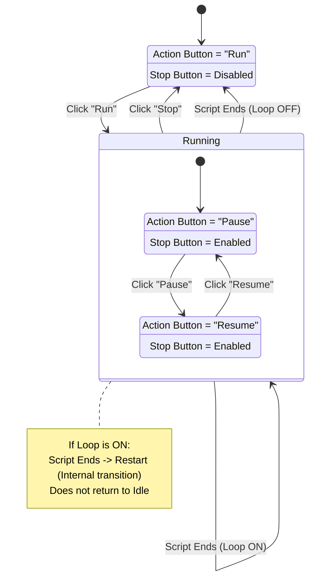

# Button Logic State Diagram

This diagram illustrates the state transitions for the Run/Pause/Stop/Loop button logic.

## Detailed Transitions

| Initial State | Event | Action | Target State |
| :--- | :--- | :--- | :--- |
| **Idle** | Click "Run" | Start Script | **Running (Active)** |
| **Running (Active)** | Click "Pause" | Pause Execution | **Running (Paused)** |
| **Running (Paused)** | Click "Resume" | Resume Execution | **Running (Active)** |
| **Running (Any)** | Click "Stop" | Terminate Script | **Idle** |
| **Running (Any)** | Script Ends | (Loop OFF) Cleanup | **Idle** |
| **Running (Any)** | Script Ends | (Loop ON) Restart | **Running (Active)** |

## Button States by Mode

| System State | Action Button Text | Stop Button | Loop Button |
| :--- | :--- | :--- | :--- |
| **Idle** | "Run" | Disabled | Enabled (Toggle) |
| **Running** | "Pause" | Enabled | Enabled (Toggle) |
| **Paused** | "Resume" | Enabled | Enabled (Toggle) |
