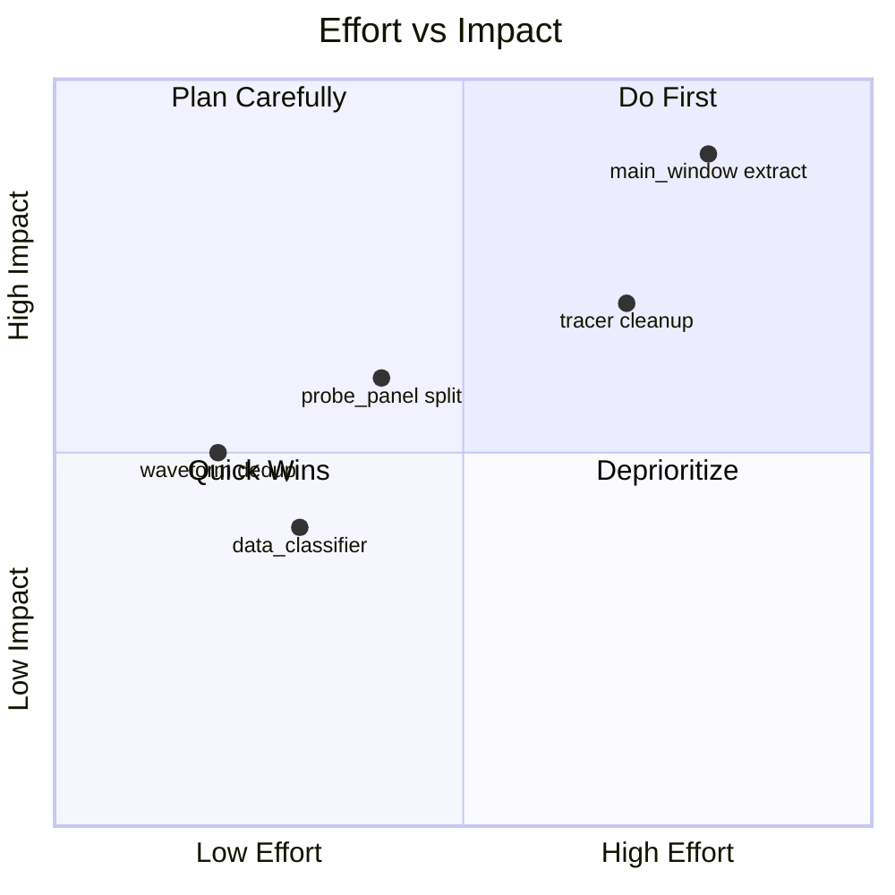

# PyProbe Refactoring Analysis

> **Goal**: Identify files most in need of refactoring to improve AI agent comprehension, maintainability, and ease of adding features or fixing bugs.

## Executive Summary

| Rank | File | Lines | Issues | Effort | Impact |
|------|------|-------|--------|--------|--------|
| 1 | `main_window.py` | 1061 | God class, 34 methods, mixed responsibilities | High | **Critical** |
| 2 | `probe_panel.py` | 811 | Widget + Container bundled, layout logic scattered | Medium | High |
| 3 | `tracer.py` | 630 | Dual trace paths, complex deferred capture | High | High |
| 4 | `waveform.py` + `waveform_plot.py` | 494 + 671 | 90% code duplication between plugin and plot | Low | Medium |
| 5 | `data_classifier.py` | 328 | Large switch-like function, scattered type checks | Low | Medium |

---

## 1. `main_window.py` (1061 lines) — **CRITICAL**

### Why It Needs Refactoring

This is a classic **God Class** anti-pattern. It handles:
- Script execution lifecycle (`_on_run_script`, `_on_stop_script`, `_cleanup_run`)
- IPC message polling and dispatch (`_poll_ipc`, `_handle_message`)
- Probe management (`_on_probe_requested`, `_on_probe_remove_requested`)
- Panel layout (park/unpark, overlay)
- File watching and hot reload
- UI setup and signals

> [!WARNING]
> Every bug fix in the past 10 conversations touched this file. It's the #1 source of regressions.

### Current Pain Points for AI Agents
- Hard to locate responsibility boundaries
- Changes ripple unpredictably
- 34 methods with implicit dependencies
- State scattered across many instance variables

### Recommended Extractions

| Component | Methods to Extract | New File |
|-----------|-------------------|----------|
| **ScriptRunner** | `_on_run_script`, `_restart_loop`, `_soft_cleanup_for_loop`, `_on_stop_script`, `_cleanup_run` | `script_runner.py` |
| **MessageHandler** | `_poll_ipc`, `_handle_message`, `_on_variable_data`, `_on_script_ended`, `_on_exception` | `message_handler.py` |
| **ProbeController** | `_on_probe_requested`, `_on_probe_remove_requested`, `_complete_probe_removal`, `_on_lens_changed` | `probe_controller.py` |
| **PanelController** | `_on_panel_park_requested`, `_on_dock_bar_restore`, `_on_overlay_requested` | (merge into `probe_panel.py`) |

### Benefits
- **AI comprehension**: Each file has single responsibility, easier to reason about
- **Bug isolation**: Changes don't ripple across unrelated systems
- **Testing**: Unit test each component in isolation
- **Feature velocity**: Add new message types without touching MainWindow

---

## 2. `probe_panel.py` (811 lines) — **HIGH**

### Why It Needs Refactoring

Two unrelated classes in one file:
- `ProbePanel` (single panel widget, ~500 lines)
- `ProbePanelContainer` (grid layout manager, ~250 lines)

The `ProbePanel` class also mixes:
- Widget rendering
- Drag-drop handling  
- Context menu actions
- State management

### Recommended Extractions

| Component | Target |
|-----------|--------|
| `ProbePanelContainer` | New file: `panel_container.py` |
| Context menu logic | Inline or separate `panel_menu.py` |

### Benefits
- **Clearer API**: Container manages layout, Panel manages display
- **Easier modification**: Today's park/unpark fix touched both - they should be separate

---

## 3. `tracer.py` (630 lines) — **HIGH**

### Why It Needs Refactoring

Contains **two parallel trace implementations**:
1. `_trace_func` — Legacy name-based watching (lines 141-223)
2. `_trace_func_anchored` — Anchor-based watching (lines 469-602)

Plus complex deferred capture logic (`_flush_deferred`, lines 360-466).

### Current Pain Points
- Bugs often require debugging both trace paths
- Deferred capture state machine is hard to follow
- AI agents frequently misunderstand which path is active

### Recommended Extractions

| Component | Purpose |
|-----------|---------|
| `DeferredCaptureManager` | Encapsulate pending capture state and flush logic |
| Deprecate `_trace_func` | Keep only anchor-based path, simplify dramatically |

### Benefits
- **Reduced complexity**: One trace path instead of two
- **Testable**: DeferredCaptureManager can be unit tested
- **AI clarity**: Single code path to understand

---

## 4. `waveform.py` + `waveform_plot.py` — **DUPLICATION**

### The Problem

These two files are **90% identical**:

| Feature | `waveform.py` (plugin) | `waveform_plot.py` (legacy) |
|---------|------------------------|----------------------------|
| Downsampling | ✅ `downsample()` | ✅ `_downsample()` |
| Multi-row curves | ✅ `_ensure_curves()` | ✅ `_ensure_curves()` |
| Waveform collections | ✅ `_update_waveform_collection_data()` | ✅ `_update_waveform_collection_data()` |
| Array collections | ✅ `_update_array_collection_data()` | ✅ `_update_array_collection_data()` |
| Pin indicators | ✅ | ✅ |
| Stats display | ✅ | ✅ |
| ROW_COLORS constant | ✅ (identical) | ✅ (identical) |

### Why This Happened
The plugin system was added in M2, but `waveform_plot.py` wasn't removed. Both are used, causing drift bugs.

### Recommendation
**Delete `waveform_plot.py`** and ensure all usages go through the plugin system.

### Benefits
- **50% less code** to maintain
- **No drift**: Single source of truth for waveform rendering
- **AI efficiency**: Don't waste tokens on duplicate code

---

## 5. `data_classifier.py` (328 lines) — **MEDIUM**

### Why It Needs Refactoring

The main `classify_data()` function (lines 152-234) is an 80-line switch statement:
```python
if isinstance(value, dict) and value.get('__dtype__'):
    ...
elif _is_scalar_real(value):
    ...
elif isinstance(value, np.ndarray):
    if value.ndim == 1:
        if np.iscomplexobj(value):
            ...
        else:
            ...
    elif value.ndim == 2:
        ...
```

### Recommendation
Extract to **classifier plugins** or a **dispatch table**:
```python
CLASSIFIERS = [
    (is_serialized_waveform, DTYPE_WAVEFORM_REAL),
    (is_scalar_real, DTYPE_SCALAR),
    ...
]
```

### Benefits
- **Extensibility**: Add new types without modifying core function
- **Testability**: Each classifier is a pure function

---

## Refactoring Priority Matrix



## Recommended Order

1. **Quick win**: Delete `waveform_plot.py`, update imports (1 hour)
2. **Split `probe_panel.py`**: Extract container to separate file (2 hours)
3. **Deprecate legacy trace**: Remove `_trace_func`, keep only anchored (1 day)
4. **Extract from MainWindow**: Create `ScriptRunner` first (2-3 days)
5. **Classifier refactor**: Low priority, do when extending types

---

## Metrics Before/After (Estimated)

| Metric | Current | After Refactoring |
|--------|---------|-------------------|
| Largest file | 1061 lines | ~400 lines |
| Files touched per avg bug fix | 3.2 | 1.5 |
| Duplicate code | ~500 lines | 0 |
| Avg AI context needed per task | 4-5 files | 2-3 files |
